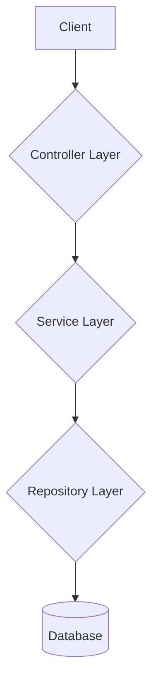
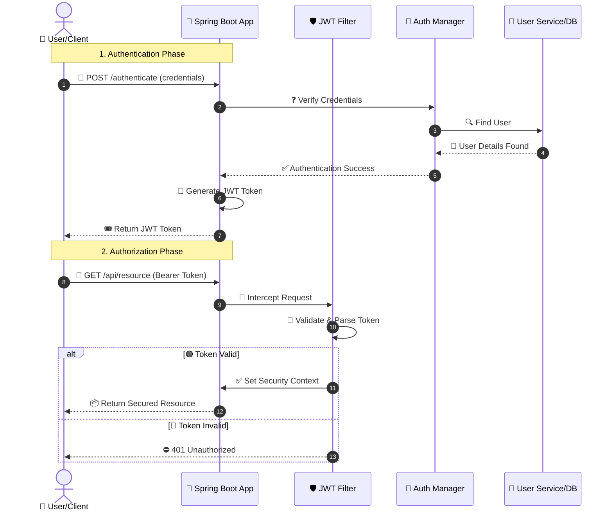

# 🛡️ Spring Security Essentials 🛡️

Welcome to the Spring Security Essentials project! This repository is designed to demystify Spring Security for developers of all levels, from beginners taking their first steps to experienced professionals brushing up for interviews. 🚀

This project was created as a hobby to provide practical, hands-on examples of various security implementations in a Spring Boot environment.

## ✨ Key Features

*   **Framework:** Built with **Spring Boot 3** and **Java 17**.
*   **🔐 Security Implementations:**
    *   In-Memory Authentication
    *   JDBC (Database) Authentication
    *   JWT (JSON Web Token) Authentication & Authorization
*   **💾 Data Persistence:**
    *   Spring Data JPA with **MySQL**
    *   **Redis** for caching or session management
*   **☁️ Microservices Ready:**
    *   **Eureka** Client for service discovery
    *   **Spring Cloud Config** for centralized configuration
*   **🧪 Testing:** Unit and integration tests using **JUnit** and **Mockito**.
*   **Comprehensive Documentation:** A detailed `SPRING.SECURITY.docx` file explaining core concepts with diagrams and examples.

## 🏗️ Architecture

This project follows a standard layered architecture pattern common in Spring applications.

### High-Level Application Flow

Here’s a look at how a typical request flows through the system:



### JWT Authentication Flow

The JWT authentication process is handled by a custom filter in the Spring Security filter chain.



## 🚀 Getting Started

1.  **Clone the repository:**
    ```bash
    git clone https://github.com/your-username/TestingBoot.git
    ```
2.  **Configure the database:**
    *   Make sure you have a MySQL instance running.
    *   Update the `application.properties` or your centralized config with your database credentials.
3.  **Build and run the application:**
    ```bash
    mvn spring-boot:run
    ```

## 📚 Documentation

This repository includes a `SPRING.SECURITY.docx` file that provides an in-depth explanation of the concepts implemented here. It consolidates knowledge from various blogs and tutorials, with full credit given to the original authors. It's a great resource for understanding the "why" behind the code.
